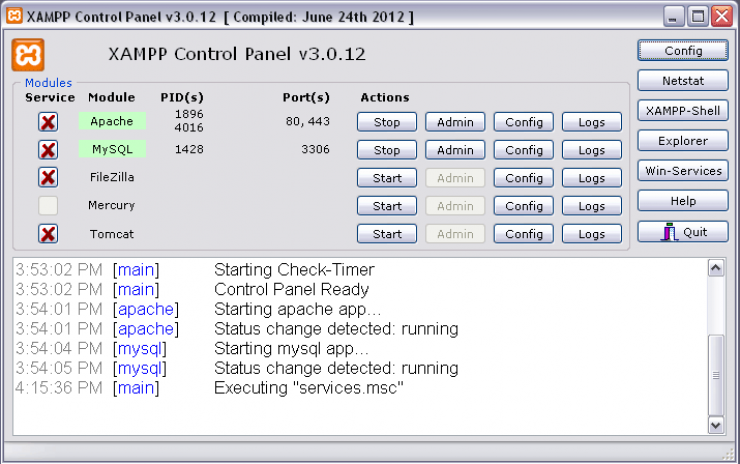
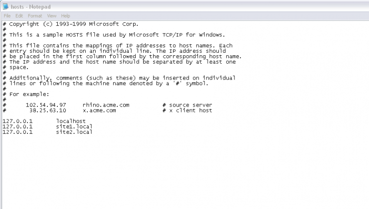
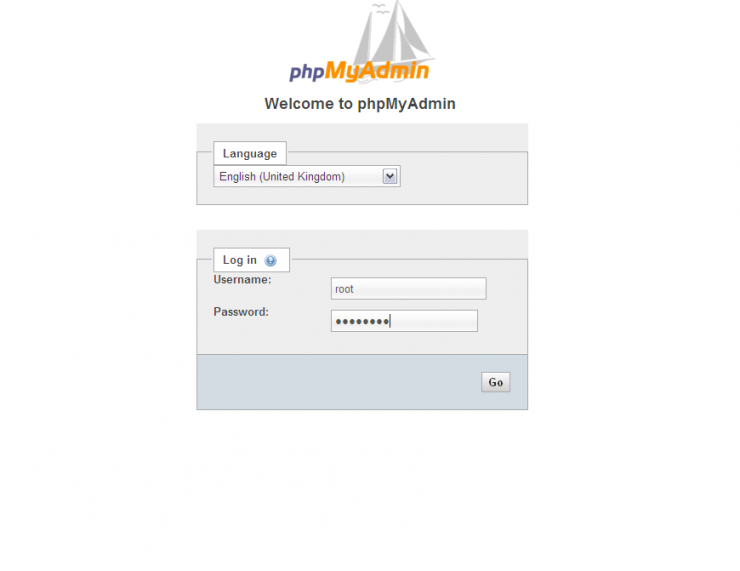
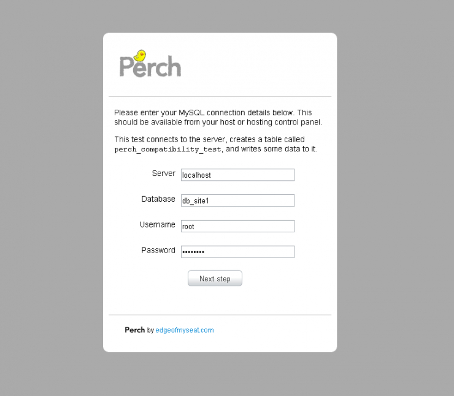

# How can I install a server to run Perch on my computer?

## This solution shows you how to get set up to develop locally using XAMPP, a package that installs Apache, PHP and MySQL to create a testing server on your computer.

If you haven’t worked with PHP and MySQL before using Perch, this tutorial will help you to set up a development environment to easily work with Perch on your own computer.

## A professional development environment

If you are building sites for clients then your process ideally would work like this:

* You develop your site locally (on your own computer or a shared development server)
* You show your client the site on a staging server
* You then deploy the site and all content entered to the live server

Perch allows you to enter these three locations against a license.

We would suggest that you avoid previewing sites in a subfolder of the live site, and certainly never to actually develop on a live server in this way. By developing in a subfolder of the live site you are creating all of your pages a level up from the root of the site. To go live you then need to move everything up a level. In the case of Perch or any script that needs to know the path from root this is problematic and will leave you needing to fix the site on going live.

Your development environment should mimic the live environment as closely as possible – especially where the location of files is concerned.

## The web and database servers

Perch stores data – the text you enter in the administration area – in a MySQL database and uses PHP to access that data. To work with Perch locally you will need to run a web and database server. This can easily be installed on the computer you use for designing and developing websites, using a packaged application.

I am going to use XAMMP for this write-up as it is available for Mac, Windows and Linux, however there are alternative products that essentially work in the same way.
Step 1: Download and install XAMMP

Go to: http://www.apachefriends.org/en/xampp.html and click the link for your Operating System.

### Mac Users:

Download the Universal Binary then open the DMG image and drag the XAMPP folder into Applications.

### Windows Users:

Choose and download the Installer version.

Double click the installer .exe and step through the install. On the screen XAMPP Options you will asked if you want to install Apache and MySQL as a service. This means that they will start up when you start your computer, if you do a lot of development then you can select this option, if not you will need to start XAMPP from the control panel before using it.

### Mac and Windows:

At the end of install start the XAMPP Control Panel when prompted.

	

## Step 2: Start Apache and MySQL

In the XAMPP Control Panel you should see Apache and MySQL listed. To start using them you need to start the services so click Start on both. If you have a Firewall on your computer you may need to grant permission for these applications.

Once you have started Apache and MySQL open a web browser and visit `http://localhost` you should see the XAMPP Splash Screen where you can select a language and the next page is a web based control panel for XAMPP.

You now have a web server running on your computer. There are a few things you should do now.

Click the Security link in the sidebar. You will see that some things are flagged up as insecure in red, below that is a link to fix the security problems. Click that and set a root password for MySQL.

You can also set a password for the XAMPP directory, however if you have a firewall that prevents incoming connections to your computer and will stop Apache and so on if using a laptop outside your network then you can leave this alone.

## Step 3: Many websites – one computer

If you only work on one website then you could simply install Perch into the default XAMPP directory and build your site there, accessible at `http://localhost`. However you probably want to be able to work on a number of sites and maintain each development environment in case the client needs some changes.

Each site served from one server is called a VirtualHost, creating VirtualHosts is essentially what shared hosting providers do to run many sites from one server. We’re going to do that now so you can have a host per site. This information should be pretty much correct if you are using XAMMP or having installed Apache in any other way.

Our aim is to create two unique sites, each with their own root directory running at http://site1.local and http://site2.local.

To create VirtualHosts you need to do three things

* Decide where you want to store the files for each site on your computer
* Edit the hosts file on your computer
* Create a VirtualHost in the Apache configuration.

### Storing your files

I usually put my sites inside a folder called Sites, one folder per site. So if I were setting up two Perch sites I might store the files like this.

* Sites/site1
* Sites/site2

The folder site1 and site2 will become the root directory for each site – I’d put the perch folder directly into each of those folders.

### The hosts file

* On Windows your hosts file is probably at: C:\\windows\system32\drivers\etc\hosts
* On a Mac you should find it at: /private/etc/hosts

What this file allows you to do is map a domain name to your local computer, so that when you enter that domain name in the browser instead of looking it up externally and trying to find a website out there on the Internet, it looks on the local computer. These domain names can be anything you like, I tend to use clientname.computername so my iMac is called ‘bubble’ and therefore a site for a client named ABC Widgets would be found at abcwidgets.bubble in a web browser. You could also use something like abcwidgets.local. It’s a good idea to use something that shows this is a local site.

**Note that:**

* you need root or administrator privileges to edit this file
* you must edit it with a plain text editor like Notepad (a code editor should be fine)
* take a backup before making any changes – just in case!

Edit the hosts file and at the end add a line for each of your sites:

    127.0.0.1 site1.local
    127.0.0.1 site2.local

* Save the hosts file.
* The Apache configuration

Inside the xampp folder at `Applications/xampp` or `C:xampp open apache > conf > extra > httpd-vhosts` using the same plain text editor that you used to edit the hosts file.

At the bottom of this file add the following code:

    NameVirtualHost *

    <VirtualHost *>
      DocumentRoot "C:xampphtdocs"
      ServerName localhost
    </VirtualHost>

    <VirtualHost *>
      DocumentRoot "C:Sitessite1"
      ServerName site1.local
      <Directory "C:Sitessite1">
        Order allow,deny
        Allow from all
      </Directory>
    </VirtualHost>

    <VirtualHost *>
      DocumentRoot "C:Sitessite2"
      ServerName site2.local
      <Directory "C:Sitessite2">
        Order allow,deny
        Allow from all
      </Directory>
    </VirtualHost>

You will need to ensure the paths and ServerNames are correct for your computer so here is an explanation of each section of this code.

The first line we add tells Apache we want to use VirtualHosts:

    NameVirtualHost *

The next section maintains http://locahost pointing at the xampp htdocs directory so that you keep your handy XAMPP tools and access to PHPMyAdmin for MySQL.

    <VirtualHost *>
      DocumentRoot "C:xampp\htdocs"
      ServerName localhost
    </VirtualHost>

We then add two sections, one for each of our sites. To add a new site you will only need to add another of these sections. Inside `<VirtalHost>` tags we give the location of our files in two places, for DocumentRoot and also within the Directory tag. We also give the ServerName and this should be the same as the name for this site you added to the hosts file.

    <VirtualHost *>
      DocumentRoot "C:Sites\site1"
      ServerName site1.local
      <Directory "C:Sites\site1">
        Order allow,deny
        Allow from all
      </Directory>
    </VirtualHost>

Save this file. Now go back to the XAMPP Control Panel and stop and start Apache. Once it has restarted go to your web browser and type in http://site1.local. Unless you have added some files already with an index.php or index.html you will get a forbidden message. However if you put site files – or even just an index.html with the name of the site in it, in each directory you will find you have two individual sites.

## Step 4: Create a database

If you are going to install Perch then you need a database for Perch to put your content into. To create a database visit `http://localhost` again in your web browser.

In the sidebar of the XAMPP page, under Tools click PHPMyAdmin. This is a web based tool for managing databases that XAMPP has installed. Usefully, this is also the most common web based tool used by web hosts so it is likely that when you come to move your site live you will also encounter PHPMyAdmin.

Log in with the username root and the password you set as your MySQL root password earlier in this process.

	

The initial screen gives you some information about the server, in the panel on the left are databases that are already installed by XAMPP, you can ignore these, we’ll create a new database for Perch to use. You should create a new database for each Perch installation you run locally.

To create the database click the Databases navigation item at the top of the initial screen.

In the Create Database section of this page enter the name you would like your database to have (usually you would use the site name as part of this) and select under Collation the option `utf8_general_ci`. This ensures that data stored in the database is stored as `utf8` so you should not have any problems with any special characters entered.

Click Create and you now have a database ready to go.

## Step 5: Test your new setup by running the Perch Compatibility Test

You should be all set now to develop your sites locally. A good final test will be to use one of our sites plus the database we just created to run the Perch Server Compatibility Test.

Download the test.

Unzip it and place it into one of your sites – I’m using my site1.

Visit the perch test folder in the site on the server in a web browsers. I have to go to http://site1.local/perchtest. You should see the first screen of the test.

Complete the details. Your server is localhost – a database server running on the same physical computer as the files. Your database is the one you just created – for me db_site1, then add username root and give the root password that you created. Click Next Step and if you have followed these instructions fully you should find you get a Pass.In that case you are all ready to run Perch! Just use the same details that passed the test when installing Perch.

## Quick Reference for adding a new site

This has all been quite longwinded as we’ve had to install and configure lots of bits to get you up and running. However next time you need to add a new site you can follow these steps.

* Create a folder on your computer for the files
* Edit your host file to add the site name
* Edit httpd-vhosts to add the VirtualHost
* Restart Apache using the XAMPP Control Panel
* Create a database for your site using PHPMyAdmin
